# System Architecture

## Overview

The Multi-Agent Job Application System is built using a modular, agent-based architecture that coordinates multiple specialized AI agents to automate the job search and application process.

## Architecture Diagram

```mermaid
graph TB
    %% User Interface Layer
    subgraph "User Interface Layer"
        CLI[Command Line Interface<br/>main.py]
        API[Programmatic API<br/>orchestrator_agent.py]
        WEB[Web Dashboard<br/>Future Feature]
    end

    %% Orchestration Layer
    subgraph "Orchestration Layer"
        ORCH[Orchestrator Agent<br/>Workflow Coordinator]
        WORKFLOW[Workflow Engine<br/>State Management]
        SESSION[Session Manager<br/>Tracking & Recovery]
    end

    %% Agent Layer
    subgraph "Agent Layer"
        subgraph "Core Agents"
            JSA[Job Search Agent<br/>Multi-source Job Discovery]
            SAA[Skills Analysis Agent<br/>AI-powered Skill Extraction]
            RAA[Resume Analysis Agent<br/>Resume Parsing & Analysis]
            RMA[Resume Modification Agent<br/>AI Resume Optimization]
            AA[Application Agent<br/>Web Automation & Submission]
        end
        
        subgraph "Base Infrastructure"
            BA[Base Agent Class<br/>Error Handling & Retries]
            LOG[Logging System<br/>Structured Logging]
            VAL[Input Validation<br/>Data Sanitization]
        end
    end

    %% Data Layer
    subgraph "Data Layer"
        subgraph "Storage"
            DB[(SQLite Database<br/>Application Tracking)]
            FS[File System<br/>Resumes & Logs]
            CACHE[Memory Cache<br/>Session Data]
        end
        
        subgraph "External APIs"
            OPENAI[OpenAI GPT API<br/>AI-powered Analysis]
            LINKEDIN[LinkedIn Jobs API<br/>Job Discovery]
            INDEED[Indeed Jobs API<br/>Job Discovery]
            GLASSDOOR[Glassdoor API<br/>Job Discovery]
        end
    end

    %% Utility Layer
    subgraph "Utility Layer"
        subgraph "Core Utilities"
            REPORTS[Report Generator<br/>Analytics & Insights]
            DB_UTIL[Database Utilities<br/>CRUD Operations]
            LOGGER[Logger Setup<br/>File & Console Output]
        end
        
        subgraph "Analysis Tools"
            SKILL_MATCH[Skill Matching<br/>Gap Analysis]
            RESUME_OPT[Resume Optimization<br/>ATS Compatibility]
            TREND_ANAL[Trend Analysis<br/>Market Insights]
        end
    end

    %% Configuration Layer
    subgraph "Configuration Layer"
        CONFIG[Configuration Manager<br/>Environment Variables]
        ENV[Environment Setup<br/>.env File Management]
        VALIDATION[Config Validation<br/>Required Fields Check]
    end

    %% Safety & Monitoring Layer
    subgraph "Safety & Monitoring Layer"
        subgraph "Rate Limiting"
            RATE_LIMIT[Request Rate Limiting<br/>Job Site Protection]
            DELAYS[Application Delays<br/>Anti-bot Measures]
        end
        
        subgraph "Monitoring"
            METRICS[Performance Metrics<br/>Success Rates]
            ALERTS[Error Alerts<br/>System Health]
            AUDIT[Audit Trail<br/>Activity Logging]
        end
    end

    %% Data Flow
    CLI --> ORCH
    API --> ORCH
    WEB --> ORCH
    
    ORCH --> WORKFLOW
    WORKFLOW --> SESSION
    
    ORCH --> JSA
    ORCH --> SAA
    ORCH --> RAA
    ORCH --> RMA
    ORCH --> AA
    
    JSA --> OPENAI
    JSA --> LINKEDIN
    JSA --> INDEED
    JSA --> GLASSDOOR
    
    SAA --> OPENAI
    RMA --> OPENAI
    
    RAA --> FS
    RMA --> FS
    
    AA --> FS
    
    ORCH --> DB
    ORCH --> CACHE
    
    JSA --> LOG
    SAA --> LOG
    RAA --> LOG
    RMA --> LOG
    AA --> LOG
    
    LOG --> LOGGER
    LOGGER --> FS
    
    ORCH --> REPORTS
    REPORTS --> DB
    REPORTS --> FS
    
    CONFIG --> ENV
    CONFIG --> VALIDATION
    
    ORCH --> RATE_LIMIT
    ORCH --> DELAYS
    
    ORCH --> METRICS
    ORCH --> ALERTS
    ORCH --> AUDIT
    
    %% Styling
    classDef userInterface fill:#e1f5fe,stroke:#01579b,stroke-width:2px
    classDef orchestration fill:#f3e5f5,stroke:#4a148c,stroke-width:2px
    classDef agents fill:#e8f5e8,stroke:#1b5e20,stroke-width:2px
    classDef data fill:#fff3e0,stroke:#e65100,stroke-width:2px
    classDef utilities fill:#fce4ec,stroke:#880e4f,stroke-width:2px
    classDef config fill:#f1f8e9,stroke:#33691e,stroke-width:2px
    classDef safety fill:#ffebee,stroke:#b71c1c,stroke-width:2px
    
    class CLI,API,WEB userInterface
    class ORCH,WORKFLOW,SESSION orchestration
    class JSA,SAA,RAA,RMA,AA,BA,LOG,VAL agents
    class DB,FS,CACHE,OPENAI,LINKEDIN,INDEED,GLASSDOOR data
    class REPORTS,DB_UTIL,LOGGER,SKILL_MATCH,RESUME_OPT,TREND_ANAL utilities
    class CONFIG,ENV,VALIDATION config
    class RATE_LIMIT,DELAYS,METRICS,ALERTS,AUDIT safety
```

## Component Details

### 1. User Interface Layer
- **Command Line Interface**: Main entry point for users
- **Programmatic API**: For integration with other systems
- **Web Dashboard**: Future feature for visual management

### 2. Orchestration Layer
- **Orchestrator Agent**: Coordinates all other agents
- **Workflow Engine**: Manages the complete job application process
- **Session Manager**: Tracks workflow state and enables recovery

### 3. Agent Layer
- **Job Search Agent**: Discovers jobs from multiple sources
- **Skills Analysis Agent**: Extracts required skills using AI
- **Resume Analysis Agent**: Parses and analyzes resume content
- **Resume Modification Agent**: Optimizes resumes for specific jobs
- **Application Agent**: Automates job application submission

### 4. Data Layer
- **SQLite Database**: Persistent storage for tracking applications
- **File System**: Storage for resumes, logs, and generated content
- **External APIs**: Integration with job boards and AI services

### 5. Utility Layer
- **Report Generator**: Creates analytics and insights
- **Database Utilities**: Handles data persistence operations
- **Analysis Tools**: Provides skill matching and trend analysis

### 6. Configuration Layer
- **Configuration Manager**: Centralized configuration handling
- **Environment Setup**: Manages .env file and environment variables
- **Validation**: Ensures required configuration is present

### 7. Safety & Monitoring Layer
- **Rate Limiting**: Prevents overwhelming job sites
- **Monitoring**: Tracks system performance and health
- **Audit Trail**: Logs all system activities

## Data Flow

1. **User Input**: CLI or API receives job search parameters
2. **Orchestration**: Orchestrator Agent plans the workflow
3. **Job Discovery**: Job Search Agent finds relevant positions
4. **Skills Analysis**: Skills Analysis Agent extracts requirements
5. **Resume Processing**: Resume agents analyze and optimize
6. **Application**: Application Agent submits applications
7. **Tracking**: All activities are logged and stored
8. **Reporting**: Analytics and insights are generated

## Security & Safety Features

- **Rate Limiting**: Built-in delays prevent overwhelming job sites
- **Input Validation**: All user inputs are sanitized and validated
- **Error Handling**: Comprehensive error recovery and logging
- **Simulation Mode**: Test applications without actual submission
- **Audit Logging**: Complete activity trail for compliance

## Scalability Considerations

- **Modular Design**: Agents can be scaled independently
- **Async Operations**: Non-blocking operations for better performance
- **Database Optimization**: Efficient queries and indexing
- **Caching**: In-memory caching for frequently accessed data
- **Horizontal Scaling**: Multiple instances can run simultaneously

## Integration Points

- **OpenAI API**: For AI-powered analysis and optimization
- **Job Board APIs**: For job discovery and application
- **File Systems**: For resume storage and management
- **Databases**: For application tracking and analytics
- **Logging Systems**: For monitoring and debugging

## Future Enhancements

- **Web Dashboard**: Visual interface for system management
- **Machine Learning**: Enhanced skill matching algorithms
- **Multi-language Support**: International job market support
- **Advanced Analytics**: Predictive insights and recommendations
- **API Gateway**: RESTful API for external integrations
